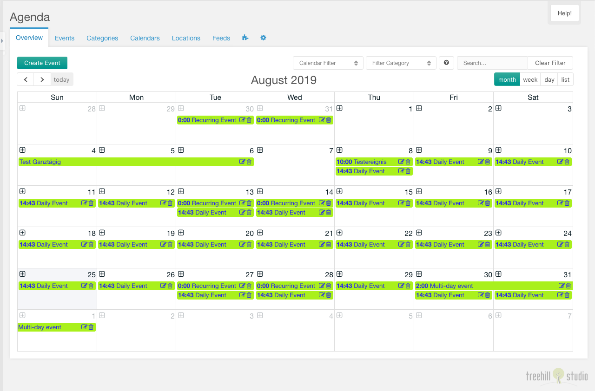
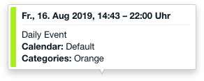

This tab contains a calendar view of the current month. 

You could create a new event with a click on the plus sign at beneath the day
number in the month view (or the date/weekday in the week/day view). There is
also a create event button on the top left of the tab.

The calendar could be filtered by calendar or category dropdown selects and by a
search input on the top right of the tab.

The arrow buttons on the top left could be used to switch the event month (in
the month view). If you click on today, the calendar will show the current day
in the selected view.

The view mode could be changed on top right to the month view, the week view,
the day view and the list view.

Each event could be edited by a click on the edit icon displayed on an event. It
could be deleted after a confirmation with a click on the trash icon.

There is also a hover popup for each event, that shows a short information for
the hovered event.

## Create/Edit

The create/edit window for one event has a lot of options, that could be set.

In the event tab you have to set the event title and the event calender, where
the event is shown in. The event could be linked with a MODX resource. This combo
field is only shown, when the system setting `agenda.parents_event` is filled
with a comma separated list of resources, that are parents for the resources
selectable with the combo field. An event should have a start date/time and an
end date/time and it could have a location. The location could be directly
created/edited in the event tab.

The event could be restricted to a context, it has to be tagged with at least
one category and it could be toggled to inactive. If the `All Day Event`
checkbox is checked, the events don't have a time input.

If the event is set as recurring event, an additional section is visible. There
you could set the recurring type. On base of the recurring type, you have
different inputs visible.

With the interval the event repeats could be restricted to every `X`
days/months/weeks/years. The repeats will be calculated until the date set in
the last occurence input. There is a maximum of 100 recurring events that are
generated during saving an event. This maximum could be changed with the
optional createable `agenda.repeating_max_occurance` system setting. With the
`weekly` recurring type, you could set the weekdays, where the event will start.
The start date/time will then be recalculated on base of the first recurring
event. With the `monthly by weekday` recurring type, you could set the event
i.e. to the second wednesday or last tuesday of a month.

In the repeats tab you could view the repeats of the current event. You could
edit and delete each repeat. The repeats are recalculated (after a warning)
during saving the event when the recurring settings of an event are changed.

In the description tab you could set the description for the current event. In
the content tab you could set the content for the current event. The editor type
of the content/description input could be set with the `agenda.editor_type`
system setting to htmleditor (the system wide richtext editor) or textarea.

After an event is saved, you could attach images and videos to the saved event
in the images/videos tab. Each image/video could have a title and a description.
It could also be toggled to inactive.

In the user tab you could restrict the event to multiple users and/or multiple
usergroups.
