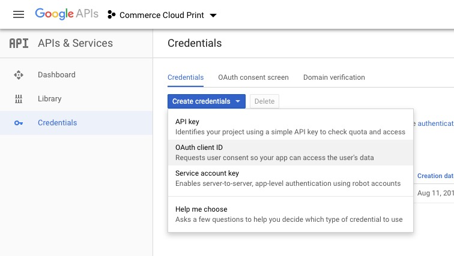
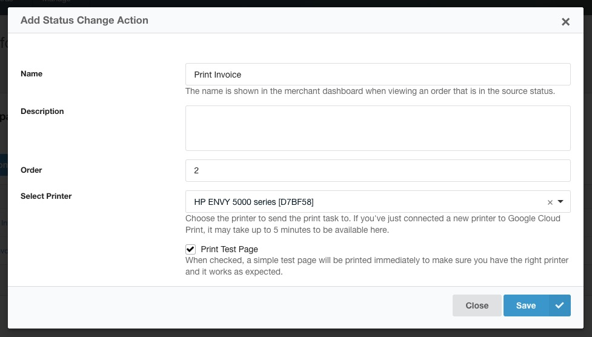

The CloudPrint module is available as a [separate extension](https://modmore.com/commerce/extensions/cloudprint/). It's free to use, and covered by your standard modmore support.

With CloudPrint, you can magically print [invoices](../Invoices) or any document based on a [twig template](../Front-end_Theming) on a [Google Cloud Print connected printer](https://www.google.com/cloudprint/learn/printers/). It runs as part of the [status workflow](../Statuses), making it perfect to print order summaries, packing slips, or shipping labels.

Cloud Print also supports saving to Google Drive. 

[TOC]

## Authorization

You need to take a few steps to set up access to the printers.

Start by installing the `CloudPrint for Commerce` package from the modmore.com package provider, and navigating to Extras > Commerce > Modules. Find CloudPrint in the list, and click it to edit the configuration.

### Setting up Google Credentials

Before you can authorize Commerce, you need to set up OAuth credentials with Google.

First, [login to the Google Developer Console](https://console.developers.google.com/apis/credentials) and create new credentials for OAuth client ID.



If you haven't previously set up OAuth flows, you may need to first configure the OAuth Consent Screen first. 

Choose *Web Application* for the Application Type.

It's important to add the right URL to the _Authorized Redirect URIs_ section. This URL is generated for you and shown in the Module configuration window in Commerce. (If you don't see it, make sure the Client ID is empty and save the module)

Back in the Google Developer Console, save the new credentials, and copy/paste the Client ID and Client Secret into the module configuration.

Important: **Save the module**. 

### Authorize 

After adding the Client ID and Secret and saving the module, there's now an _Authorize_ button that will send you to the Google to authorize your credentials to access the cloud printers. 


When returning to Commerce, a one-time code is converted into a _Refresh Token_ that is automatically stored on the module, which allows CloudPrint to securely access configured printers. 

If someone else needs to provide the authorization, you can right click and copy the URL on the Authorize button to send it to the person with access to the required Google account. **Note**: that person does need manager access, including access to Commerce, to complete the OAuth flow. 

To confirm the authorization was saved, you can return to Configuration > Modules > Cloud Print, and look for the checkmark and authorization date. The module is automatically enabled in test and live mode on successful authorization.

## Status Changes

When you've authorized access to your printers, it's time to set up the print jobs.

All print jobs are added into the [status workflow](../Statuses), so navigate to Commerce > Statuses.
 
### Printing the PDF invoice

Let's say we have a Status Change called "Prepare for shipping", during which we already set up [PDF invoice generation](../Invoices), which we want to print so it can be included in the package. 

Click on the status change name to list the actions. 

Hover over the arrow on the _Add Status Change Action_ button, and choose **Print invoice via Cloud Print**. 


The window may take a few seconds to load, as it's fetching the available printers for you from Google Cloud Print.

Give the status change action a name ("Print Invoice"), set the Order to a number that's higher than the create invoice task, and select the printer you want to use. 



If the printer isn't listed, make sure it is available in [Google Cloud Print](https://www.google.com/cloudprint/#printers). [Supported models and installation instructions can be found here](https://www.google.com/cloudprint/learn/printers.html#setup). The printers are cached, so it will take a few minutes for it to show up when first configured, or you can manually clear the cache in core/cache/commerce_cloudprint/. 

If you want to test the integration, you can click on _Print Test Page_ to send a simple test page to the printer. 

### Printing templated documents

For all other prints, you use the **Print template via Cloud Print** status change action. When creating it, you also get the selection of printer, as well as a "Twig Template" box.

You can add any valid [twig template](../Front-end_Theming), and it's recommended to use an `extends` to load it from a theme path:

```

```

All order information is available, sharing the same placeholders with [order messages](../Orders/Messages). 

Because it uses the exact same placeholders, you could even re-use an email template, like:

```

```

## Prints not working?

If the printer does not seem to respond, check your MODX error log for an error message. 

You can also [check print tasks in Google Cloud Print](https://www.google.com/cloudprint/#jobs) to make sure they're queued and processing. Note that when using the special "Save to Google Drive" printer, tasks do not show up in the list of print jobs. 

## Integrating CloudPrint in other modules

The CloudPrint module can be used by other modules, too! Modules that generate documents or reports could add a print button quite easily. 

First, offer your user the ability to select the printer to use **if** the CloudPrint module is enabled. This may be in the module configuration or a record's fields. 

This example is for adding the field to module configuration:

```php
use modmore\Commerce_CloudPrint\Admin\PrinterField;
// ...

class MyModule extends BaseModule {
    // ...
    public function getModuleConfiguration(\comModule $module): array
    {
        $fields = [];
        // ...
        if (class_exists(PrinterField::class)) {
            $fields[] = new PrinterField($this->commerce, [
                'label' => $this->adapter->lexicon('commerce_cloudprint.select_printer'),
                'description' => $this->adapter->lexicon('commerce_mymodule.select_printer.desc'), // add a description specific to your module explaining what the printer is for
                'name' => 'properties[printer]',
                'value' => $module->getProperty('printer'),
                'emptyOption' => true, // if the printer is optional
            ]);
        }
        // Optionally, add an else clause with a DescriptionField telling the user the module supports CloudPrint
        // ...
        return $fields;
    }
}
```

Then, when you have something to print, make sure a printer is selected, create a `Printer` object, and call its `print()` method:

``` php

use modmore\Commerce_CloudPrint\Auth;
use modmore\Commerce_CloudPrint\Printer;

class SomeClass
{
    public function sendToPrinter()
    {
        // Retrieve the comModule instance to fetch our printer ID
        $module = $this->adapter->getObject('comModule', ['class_name' => MyModule::class]);
        if (!($module instanceof comModule)) {
            return 'Module not found.';
        }
        
        $printerId = $module->getProperty('printer');
        if (empty($printerId)) {
            return 'No printer set.';
        }
        $printer = new Printer(new Auth($this->commerce), $printerId);
        
        $title = 'My Amazing Print';
        $contentType = 'application/pdf';
        $contents = 'raw pdf contents, e.g. file_get_contents($pdfFile)';
        
        $result = $printer->print($title, $contentType, $contents);
        if ($result->isSuccessful()) {
            return 'Success! ' . $result->getMessage();
        }
        return 'Error: ' . $result->getMessage();
    }
}
```

The `print()` method returns a `PrintResult` object, which has the following methods:

- `isSuccessful(): bool`
- `getMessage(): string` will return either a success or error message. For an error message, the error code is prefixed between square brackets.
- `getErrorCode(): ?string` will return an error code or `null` if no error code was set.
- `getStatus(): string` will return a string indicating the print job status. Typically, this is `QUEUED`. 
- `getOwnerId(): string` returns the email address of the printer owner. 
- `getRawResponse(): array` returns the raw response from the Cloud Print `/submit` API. 

To print, you don't need to submit a PDF. HTML (set the content type to `text/html`), URLs (set the content type to `url` and provide the url as content), images (`image/jpeg`, `image/png`) and various other formats are also supported. [See the Google Cloud Print documentation for contentType](https://developers.google.com/cloud-print/docs/appInterfaces#parameters)

If you need to generate a PDF from HTML, you can use a [PDF Writer](../Developer/PDF_Writer). 

The `print()` method will throw a `PrintException` for invalid requests.
