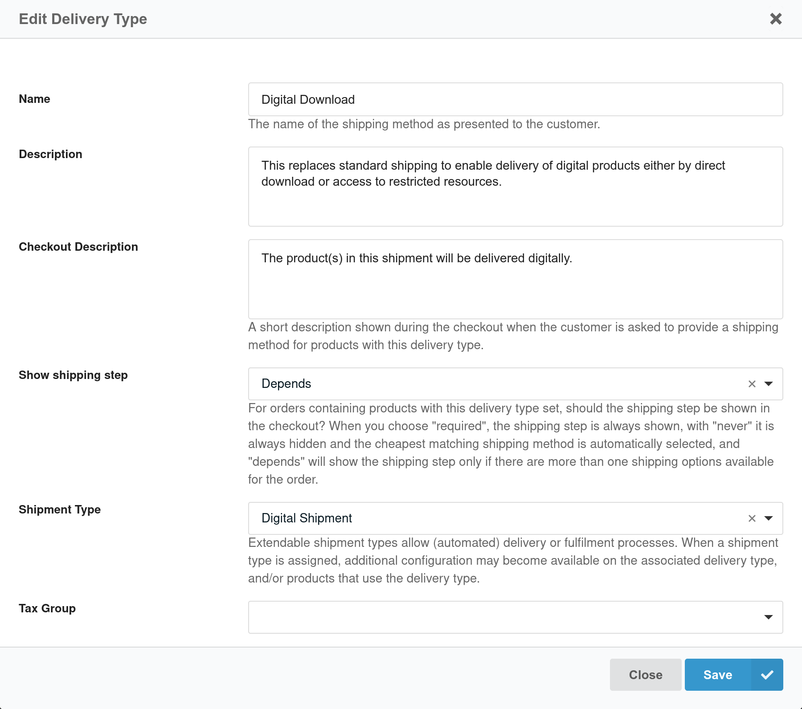

Digital Product for Commerce is a highly configurable module that enables you to deliver your products digitally.

Originally developed and maintained by [Tony Klapatch](https://github.com/tonyklapatch) as a third-party extension not covered by modmore's support,
in April 2021 modmore adopted the project in an effort to make it compatible with recent Commerce releases,
and to include it in modmore's standard support as an official extension.

Digital Product for Commerce is **available as a separate package** and from [GitHub](https://github.com/modmore/Commerce_DigitalProduct).

[TOC]

## A Couple of Common Scenarios

- **Enable access to a restricted webpage on successful payment**

  Perhaps you're selling access to an online course, or you need a paywall in place for premium articles.


- **Direct downloads on purchase**

  Provide a direct download link to a book, plugin, MODX theme, or any other digital product you're looking to sell.

## Initial Configuration

*The initial configuration is required for both the other configuration options below.*

1. Once the Digital Product extra is installed, be sure to enable it within Commerce: `Configuration -> Modules`.


2. Create a **Delivery Type** in `Configuration -> Delivery Types`, and make sure the *Shipment Type* field is set to ***Digital Shipment*** (rather than Standard Shipment).



3. Create a **Shipping Method** in `Configuration -> Shipping Methods`, and set its **Delivery Type** to be the one you just created in the last step.


4. Create a *Download Resource*. This is a page that customers won't actually view, it acts as a gateway of sorts, and checks a secret key verifying that the payment was made before forwarding them to the designated page, or facilitating a direct download (depending on your preference).


5. Set the `commerce_digitalproduct.download_resource` system setting to the ID of the **Download Resource** you just created.


6. Add the `[[!digitalproduct.get_file]]` snippet to the **Download Resource** you just created in the last two steps.


7. Override the default Commerce `thank-you.twig` template by copying it to your `customtheme/frontend/checkout/` directory.
   Edit this custom template to display the digital products or pages the customer now has access to.

Here's a basic example which loops through resources and files separately, only showing headings if there are results:

```html
<div class="c-digital-products">
    

        
            <h4>{{ digitalProduct.product.name }} {{ lex('commerce_digitalproduct.pages') }}</h4>
            
                <p><a href="[[~[[++commerce_digitalproduct.download_resource]]]]?secret={{ resource.secret }}">{{ resource.name }}</a></p>
            
        

        
            <h4>{{ digitalProduct.product.name }} {{ lex('commerce_digitalproduct.files') }}</h4>
            
                <p><a href="[[~[[++commerce_digitalproduct.download_resource]]]]?secret={{ file.secret }}">{{ file.name }}</a></p>
            
        

    
</div>
```
> As you can see in the example, within this twig file the `digitalProducts` variable is available when there are digital products on the order. There are three accessible sub-arrays you can access: resources, files, and all (containing resources and files).
>> You also have access to all fields within DigitalproductFile object: `id`, `class_key`, `properties`, `digitalproduct_id`, `secret`, `name`, `resource`, `file`, `download_count`, `download_limit`, and `download_expiry`.

If you haven't created a custom theme or overridden template files before, you can [learn how in the documentation](https://docs.modmore.com/en/Commerce/v1/Front-end_Theming.html).


## Restricted Pages Configuration

*This entails setting up a group of restricted resources and linking them to your products, so that when a payment is made, the customer is given access to those resources.*

1. Create a parent resource somewhere for the restricted pages that your customers will be granted access to, once their payment has been successful.


2. Set the `commerce_digitalproduct.resource_parents` system setting to the ID of the parent resource you just created. For multiple parents, the IDs should comma delimited.


3. Add the restricted page resources as children to that parent. (These will be selectable later when editing the digital products)


4. Create/Edit a product that you would like to make digital. Click on the **Delivery** tab and set the *Delivery Type* to your new digital delivery type created above in the initial configuration. Click `Save`.


5. After saving, go back to the *Delivery* tab and there will be new fields related to being a digital product. Click on the `Resources` field to select from any of the restricted resources you added under the parent(s) in step 3. Don't forget to `Save`.


## Direct Download Configuration

*Allows a customer to directly download a file when payment is made.*

1. Create/Edit a product that you would like to make digital. Click on the **Delivery** tab and set the *Delivery Type* to your new digital delivery type created above in the initial configuration. Click `Save`.


2. After saving, go back to the *Delivery* tab and there will be new fields related to being a digital product. In the `Files` section, enter the display name (shown to the customer) of the file to be downloaded. Then enter the full URL of the file to be downloaded.


3. Select a value in the `Download Method` field. Currently, there are two methods (with more planned) `Redirect`  and `Forced`. Redirect will send the customer to the file itself exposing the file URL. Force will keep the URL secret and trigger an immediate download.


## Other Options

*There are some other options available on the edit window for a digital product. These apply to both file downloads and restricted resource access.*

1. If you would like the customer to also be added to a user group on payment, set the `User Group Access` field to that user group. (Typically this user group would have access to a resource group containing your restricted resources, or perhaps a media source containing the files.)


2. In the `Download Limit` field, set the maximum number of times this file can be downloaded. Leave it blank to not set a limit.


3. In the `Expiration Time` field lets you set a time limit the digital product will be available.