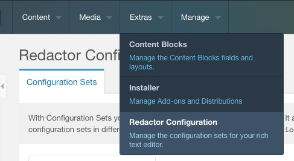

Welcome to Redactor 3. We hope this will be your favorite editor for MODX, if it isn't already. 

The focus in Redactor is on a simple, clean, and user friendly rich text editor. It's not a page builder (though it integrates extremely well with [ContentBlocks](https://modmore.com/contentblocks/)!), but does output clean markup and various types of media. 

Let's take a quick tour of Redactor!

[TOC]

## Managing Configuration

After installing Redactor, you'll find a new page in the manager dedicated to its configuration in the Extras menu. 

In this manager page, you'll manage what we call **Configuration Sets**. Each set is one unique implementation of Redactor, which can be enabled system-wide, in specific contexts, for specific templates, to the custom template variable input type or resource introtext, or ContentBlocks input types. 

For each way you can use Redactor, check the [Usage documentation](Usage).

### Default configuration sets

By default you'll find 2 configuration sets we've prepared for you: Standard and Minimal. 

- Standard is a pretty, erm, _standard_ configuration of Redactor. It covers the most commonly used features and toolbar buttons that works well. It doesn't enable all features, mind you, but a good portion of them.
- Minimal is a much more slimmed down implementation. It's toolbar is limited to basic text functionality and inserting images. 

Here's a quick side-by-side view of the Minimal vs the Standard set.

You can edit these sets as you'd like - they **will not** be overwritten on upgrade. 

> Tip: when changing a configuration, use the ctrl/cmd+s shortcut to quickly save the configuration.

### Exports & Imports

When you've spent some time creating a configuration set that you like, you can re-use it on different sites. 

- In the set configuration view, click on Export in the top right menu to export the set you're currently editing.
- In the list of sets, right click on a specific set and choose Export to export a specific set.
- In the list of sets, click the Export button on the top right of the grid to export all sets.

The generated XML file can be imported on any Redactor 3 installation by clicking the Import button in the sets overview and uploading the file. 

When importing you can choose 3 different import modes.

- With the **Insert** mode, the ID in the export is ignored and all sets in the XML file are created alongside any existing sets.
- With the **Overwrite** mode, any existing sets with the same ID of a set in the XML file will be overwritten. Existing sets that don't have a matching set in the export, are left as they were.
- With the **Replace** mode, all existing sets are first removed, before the sets in the XML file are created. 

The exports do not contain any references to where you've enabled a certain set. 

To quickly set an imported configuration set as default, you can right click it in the list of sets and choose **Set as system default**. For other ways to assign configuration sets to be used, [see the usage section](Usage). That includes per-template and per-context options, and others.

## Using the Redactor Template Variable

Redactor will automatically enhance standard MODX richtext template variables with the _default_ configuration set. This means that the content and richtext fields use the same configuration.

If you'd like to use a different configuration for a template variable, you can use the provided Redactor template variable type. [Learn more about the Redactor template variable &raquo;](Usage/Template_Variables)

## Using Redactor with ContentBlocks

Also use [ContentBlocks](https://modmore.com/contentblocks/)? Then you can use the [provided Redactor input type](Usage/ContentBlocks) to use a specific configuration set for rich text fields for more control.

## Themes

Redactor 3 ships with a selection of different editor themes, including one that looks like Redactor 2 to help ease the transition and a dark mode. [Choose the one you like most](Themes), or [build your own](Themes/Custom).

## Shortcuts & Shortcodes

With the [available shortcuts](Shortcuts) you can execute some common commands without needing to leave the keyboard.

With the [shortcodes](Shortcodes) you can start typing certain codes at the start of a new line to apply standard formatting.

## More features

It's encouraged to start editing your configuration set to learn about all the features Redactor uses. Each option has a description in the editing view to help you understand what it does.

For the more powerful functionality, we have [extended documentation](Features). The configuration set view will also link to documentation where applicable. 

## Restrict access to the configurator

To restrict access to the configurator, you can use the [provided access permissions](Permissions).
