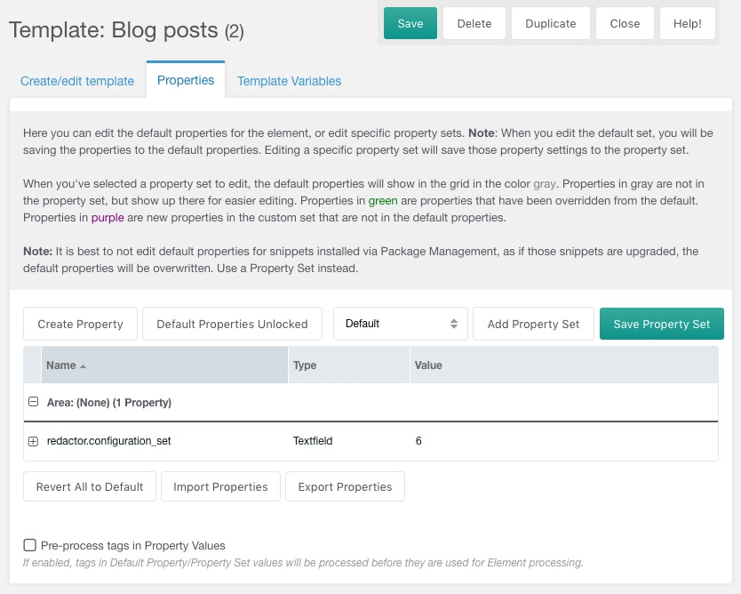

Redactor defaults to the configuration set configured through the `redactor.configuration_set` System Setting, which can be overridden with Context Settings with the same key.

There are also separate options to choose the configuration set for [Template Variables](Template_Variables), [ContentBlocks](ContentBlocks) and the [introtext field](Introtext). 

If you want to get more granular in defining the configuration set **for the content field**, you can configure a per-template configuration set. 

## How-to 

To set up a different set for a template, edit the template and go to its Properties tab.

1. First, unlock the default properties.

2. Create a new property with the key `redactor.configuration_set` and the ID of the configuration set you want to use as value.

3. Save the property set, and save the template.

When set up correctly, you should see the template listed in the Redactor Configuration grid, and editing a resource with that template will use the chosen configuration.
